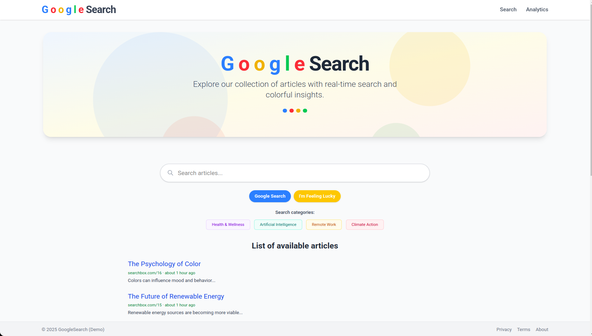

# 🔍 Realtime Search Analytics App

A modern **Rails + Hotwire + TailwindCSS** application for tracking and analyzing user search behavior in real time.  
This project demonstrates how to log, analyze, and visualize user search queries without traditional authentication, focusing on clean analytics and a responsive UI.

---



## 🚀 Features

- **Realtime Search Tracking:**  
  Uses Hotwire (Turbo + Stimulus) to capture and log user search queries as they type, without page reloads.

- **Search Analytics Dashboard:**  
  View recent searches per user, including timestamps and query details.

- **No User Authentication:**  
  Users are tracked by IP address and session, not by login.

- **Smart Query Logging:**  
  Only the final, most complete queries are stored (prevents "pyramid problem" from logging every keystroke).

- **Per-User Analytics:**  
  Each user's search history is tracked and displayed separately.

- **Modern UI:**  
  Styled with Tailwind CSS for a clean, responsive look.

- **Test Coverage:**  
  Includes RSpec tests for models, controllers, jobs, and views.

---

## 🗂️ Application Structure

- **Models**
  - `User`: Identified by IP address, has many search_articles.
  - `Article`: Searchable content, supports title/content search.
  - `SearchArticle`: Logs user queries, belongs to user.

- **Controllers**
  - `ArticlesController`: Main search interface and article listing.
  - `SearchArticlesController`: Analytics dashboard and search logging endpoint.

- **Jobs**
  - `RecordSearchJob`: Background job to log only completed search queries.

- **Views**
  - `articles/index`: Main search UI.
  - `search_articles/index`: Analytics dashboard.
  - Partials for articles and search history.
  
- **Routes**
  - `/` — Homepage, main search interface (`ArticlesController#index`)
  - `/articles` — Article listing and search (GET)
  - `/search_articles` — Analytics dashboard (GET)
  - `/search_articles/record` — Endpoint for logging search queries (POST)
---

## ✨ How It Works

1. **User visits the homepage** and sees a Google-style search interface.
2. **As the user types**, queries are sent via AJAX (Stimulus controller) and logged in the background.
3. **Only the most complete queries** are stored for analytics (not every keystroke).
4. **Analytics dashboard** shows the last 10 searches for the current user (by IP).

---

## ✅ Example: Smart Logging

```text
User types:
→ "How is"
→ "How is emil hajric"
→ "How is emil hajric doing"
```
✅ Only final query is saved: "How is emil hajric doing"

This is achieved by only storing the most complete query for each search session, preventing the "pyramid problem" of logging every keystroke.

---

## 🛠️ Gems & Dependencies

- [Turbo Rails](https://github.com/hotwired/turbo-rails)
- [Stimulus](https://github.com/hotwired/stimulus)
- [Tailwind CSS](https://tailwindcss.com/)
- [RSpec Rails](https://github.com/rspec/rspec-rails)
- [shoulda](https://github.com/thoughtbot/shoulda) 
- [shoulda-matchers](https://github.com/thoughtbot/shoulda-matchers)

---

## 🚀 Getting Started

- 1. Clone the repository

```bash
git clone https://github.com/yourusername/realtime-search-box.git
cd realtime-search-box
```

- 2. Install Ruby & Node dependencies

```bash
bundle install
yarn install # or npm install
```

- 3. Setup the database

```bash
rails db:create db:migrate db:seed # db:seed is optionalbundle exec rspec
```

- 4. Start the development server

```bash
./bin/dev
# or, if you want to run Rails and assets separately:
rails server
yarn build --watch
```
---

## 🧪 Running Tests

```bash
# Run all tests
bundle exec rspec

# Run by category
bundle exec rspec ./spec/models/
bundle exec rspec ./spec/controllers/
bundle exec rspec ./spec/jobs/
bundle exec rspec ./spec/views/
```

---

## 📝  Usage

- Visit `http://localhost:3000` to use the search interface.
- Analytics dashboard is available at `/search_articles`.

---

## ⚙️ Developer Tips

- `reload!` in the Rails console to reload code.
- `rails routes` to check available routes.

---

## 📂 Project Structure

```
app/
  controllers/
  models/
  views/
  jobs/
  javascript/
config/
db/
spec/
```

---

## 🧠 Summary
SimpleSearch App is a scalable, testable, and real-time Rails application that emphasizes user interaction analysis, not search quality itself.
It uses Hotwire to achieve snappy frontend updates and smart backend logic to only save meaningful, complete search queries.

---

## 🤝 Contributing

Pull requests are welcome! For major changes, please open an issue first to discuss what you would like to change.

---

## 📄 License

MIT License. See [LICENSE](LICENSE) for details.